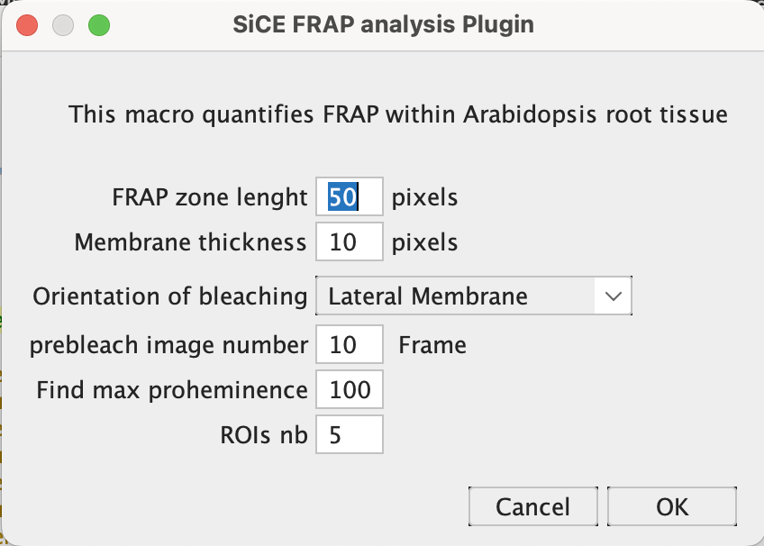
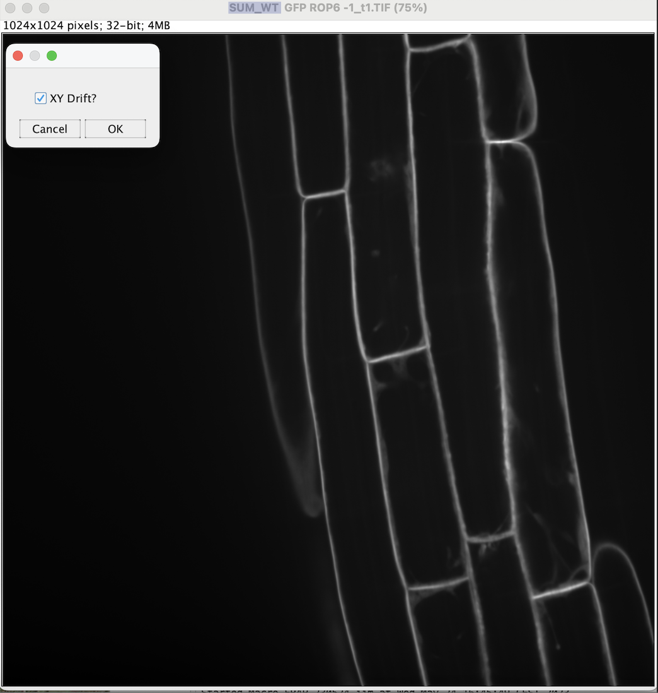
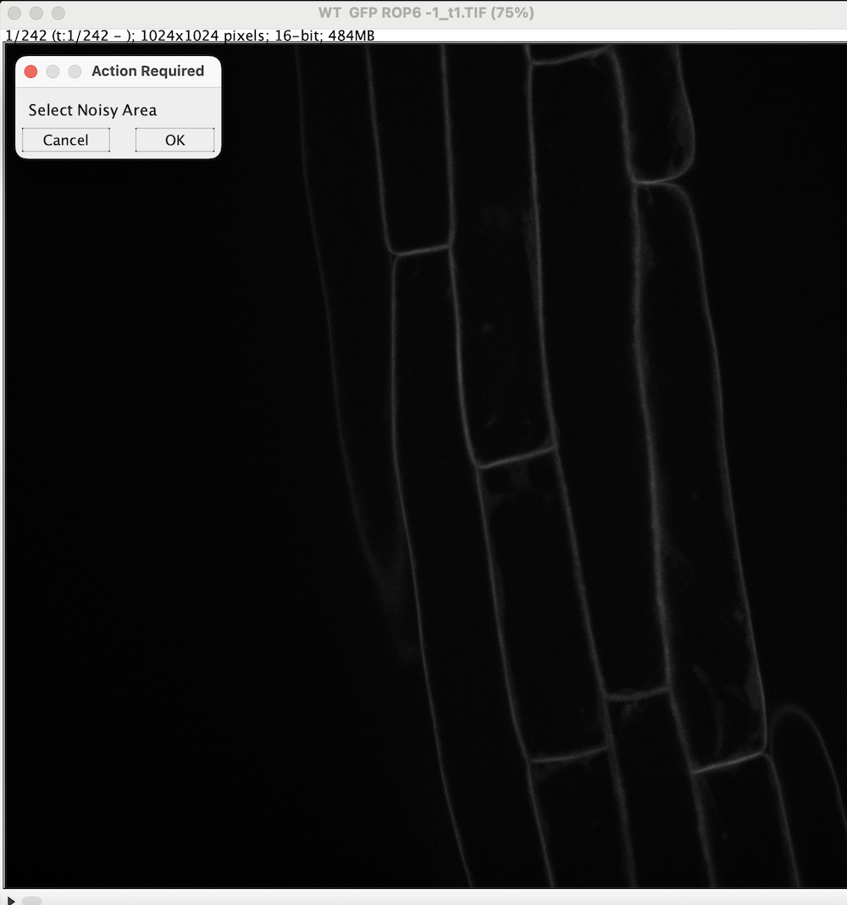
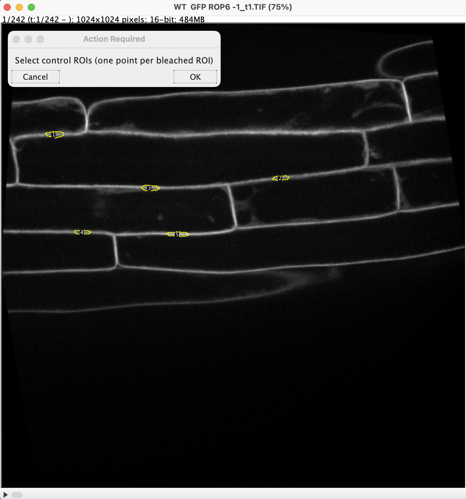
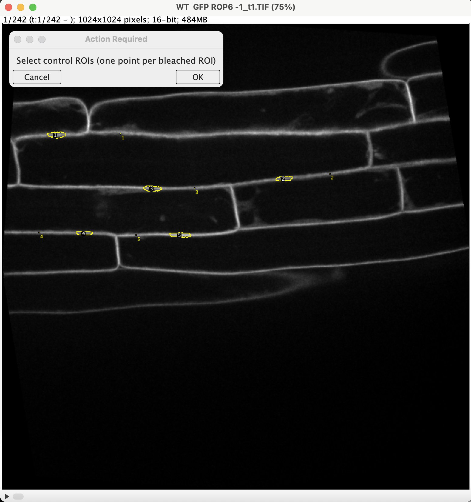
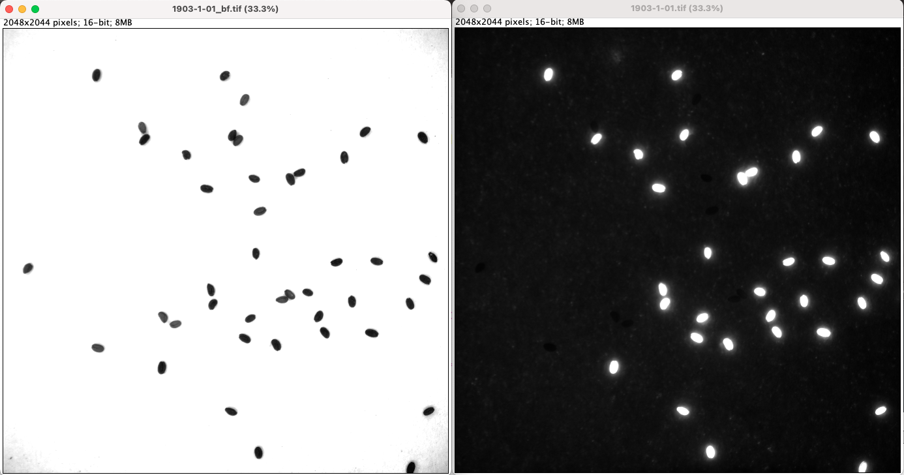
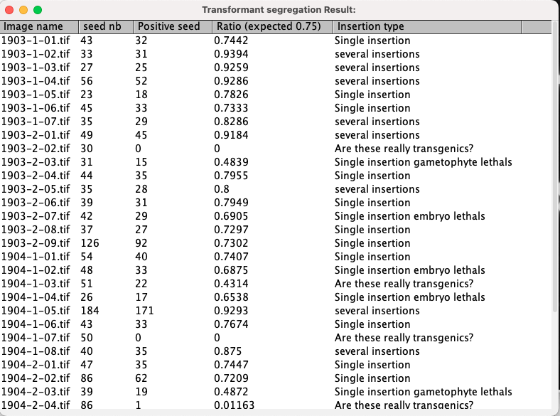

#  Welcome to SiCE_FIJI_Macro repository!

Hi! You will find here macros for FIJI developped in the [SiCE Team](http://www.ens-lyon.fr/RDP/SiCE/Home.html). As there is not website to directly install and update directly from FIJI you will have to download .ijm files and add them to the corresponding directories in your Fiji/ImageJ installation, or simply drag and drop on FIJI toolbar.

 
## Quick links
- [SiCE SpotDetector](#SpotDetector )
- [SiCE FRAPanalysis](#FRAPanalysis)
- [SiCE RootGravi](#RootGravi)
- [SiCE ToolBox](#ToolBox)
-  [SiCE FastRed](#FastRed)
- [SeedDev_Curvature](#Curvature)
- [SeedDev_Immuno](#Immuno)
- [SeedDev_Nuclei](#Nuclei)

## Macros

 ### SpotDetector 
 As described in [Bayle et al.2017](https://bio-protocol.org/pdf/bio-protocol2145.pdf), this macro allows automatic counting of the number of intracellular compartments in Arabidopsis root cells, which can be used for example to study endocytosis
or secretory trafficking pathways and to compare membrane organization between different genotypes
or treatments. While developed for Arabidopsis roots, this method can be used on other tissues, cell
types and plant species.  

 
### FRAPanalysis
This macro helps extracting fluorescence intensities from FRAP acquisitions in Arabidopsis thaliana. This method has been used in [Simon et al 2016](https://www.nature.com/articles/nplants201689) and [PLatre et al. 2019](https://www.science.org/doi/full/10.1126/science.aav9959?casa_token=BfJcTbtNSzIAAAAA%3AX1emsw9qSPBOSUtdSkBRk3tFPjSrMfrZu5W8kFS26HKSJjIu5wB61PBMvcO-gKfv6Ds7JBM9TeQXkw) publications.
- INPUT: Folder containing .stk or .nd files corresponding to FRAP time lapse acquisisions.
- Additional Plugin: [Wavelet_A_trou](FRAPanalysis) that must be copied in your FIJI/plugin folder and needed for root segmentation and [FAST4DReg](https://imagej.net/plugins/fast4dreg) plugin requested for XY drift correction.
- OUTPUT: Table containing Fluorescence intensity measuremennts for control and bleached ROIs.
1. Parameters selection: 
 
2. Folder selection.  
3. Drift correction:  
FIJI will load timelapse aquisition and make a Z projection. If a drift is observed on the resulting image click the check box, it should be corrected by fast4dreg. If there was a drift in Z, acquisition should be discarded.

5. Noise correction:  
Point Pixel outside Arabidopsis root. Mean pixel intensity will be calculated in a circular region, radius 15 pixels, and subtracted to entire image stack 
6. Root segmentation and bleached ROI detection.  
First, the entire root will be segmented and re-oriented (horizontaly if lateral mb were bleached or verticaly for apicobasal membranes) prioor to ROI detection. If the nb of bleached area if higher to the one indicated in parameter selections, you will have to remove extra-ROIs manually in the ROI manager.  
9. 
10. Control region selection:  

 
&nbsp; &nbsp; &nbsp; &nbsp;

### RootGravi
[SiCE RootGravi](RootGravi)
### ToolBox
[SiCE ToolBox](ToolBox)
### FastRed
This Fiji macro helps analysis Arabidopsis T-DNA transformed segregation with the [fast red selection](https://pubmed.ncbi.nlm.nih.gov/19891705/).The technology is based on the expression of a fluorescent co-dominant screenable marker FAST, under the control of a seed-specific promoter.The FAST marker harbors a fusion gene encoding either GFP or RFP with an oil body membrane protein that is prominent in seeds.

 - Additional PLugin: [Distance Based Watershed](https://imagej.net/plugins/distance-transform-watershed ) part of the MorphoLibJ library 
 - Macro INPUT: Folder containing Brightfield images of the seeds, name of the line ended by "_bf" and the corresponding fluo image (example: 1903-1-01_bf and 1903-1-01 pictures).
  
 - Macro OUTPUT: Table containing Pictures names, number of seeds segmented, number of fluorescent seeds and corresponding ratio and Segregation as following:  
 
**Expected segregation ratio from self-ferilized T1s:**  
 Single insertion: 75% Fluorescent & 25% Black seeds  
 Two insertions: 94%  Fluorescent & 6% Black seeds  
 Three  insertions: 94%  Fluorescent & 6% Black seeds  
 Single insertion Embryo lethal: 66% Fluorescent & 33% Black seeds  
 Single insertion Gametophyte lethal: 50% Fluorescent & 50% Black seeds  
   
[SiCE FastRed](FastRed)
 ### SeedDev_Curvature

### SeedDev_Immuno
- 
### SeedDev_Nuclei
- 
###  
- Misc...

