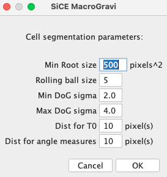

#  Welcome to SiCE_FIJI_Macro repository!

Hi! You will find here macros for FIJI developped in the [SiCE Team](http://www.ens-lyon.fr/RDP/SiCE/Home.html). As there is not website to directly install and update from FIJI you will have to download .ijm files and add them to the corresponding directories in your Fiji/ImageJ installation, or simply drag and drop on FIJI toolbar.

 
## Quick links
- [SiCE SpotDetector](#spotdetector)
- [SiCE FRAPanalysis](#frapanalysis)
- [SiCE RootGravi](#rootgravi)
- [SiCE ToolBox](#ToolBox)
- [SiCE FastRed](#fastred)
- [SeedDev_Curvature](#Curvature)
- [SeedDev_Immuno](#Immuno)
- [SeedDev_Nuclei](#Nuclei)
- [Misc](#Misc)

## Macros

### SpotDetector 

 As described in [Bayle et al.2017](https://bio-protocol.org/pdf/bio-protocol2145.pdf), this macro allows automatic counting of the number of intracellular compartments in Arabidopsis root cells, which can be used for example to study endocytosis
or secretory trafficking pathways and to compare membrane organization between different genotypes
or treatments. While developed for Arabidopsis roots, this method can be used on other tissues, cell
types and plant species.  
 
### FRAPanalysis

Acquisition protocol (on our system): 
Macro:   

This macro helps extracting fluorescence intensities from FRAP acquisitions in Arabidopsis thaliana. This method has been used in [Simon et al 2016](https://www.nature.com/articles/nplants201689) and [Platre et al. 2019](https://www.science.org/doi/full/10.1126/science.aav9959?casa_token=BfJcTbtNSzIAAAAA%3AX1emsw9qSPBOSUtdSkBRk3tFPjSrMfrZu5W8kFS26HKSJjIu5wB61PBMvcO-gKfv6Ds7JBM9TeQXkw) publications.
- INPUT: Folder containing .stk or .nd files corresponding to FRAP time lapse acquisisions.
- Additional Plugin: [Wavelet_A_trou](FRAPanalysis) that must be copied in your FIJI/plugin folder and needed for root segmentation and [FAST4DReg](https://imagej.net/plugins/fast4dreg) plugin requested for XY drift correction.
- OUTPUT: Table containing Fluorescence intensity measuremennts for control and bleached ROIs.
1. Parameters selection: 
 
 
 | Parameter | How to setup | Info | 
| :--------------- |:---------------:| -----:|
| FRAP zone lenght  |  Diameter of the bleached region during acquisition | Needed for  Bleached ROI segmentation and Measurement ROIs selection |
| Membrane thickness  | Measure roughly membrane thickness |  Needed for Measurement ROIs |
| Bleaching Orientation | Depends on your FRAP setup: Lateral-ApicoBasal membranes or Cortical (top view)  |  Needed for proper root reorientation as well as Measurement ROIs selection (Rectangle for Lateral-ApicoBasal , Circular for Cortical|
| Prebleach Image number  | Depends on your FRAP setup, ideally frame number where the bleaching is maximal          |   Needed to identify bleached ROIs |
 | Find max proheminence | Depends on your signal noise ratio (higher value for high S/R) | Needed for root segmentation | 
  | ROIs nb | Depends on your FRAP setup | Needed for aberrant bleached ROIs removal | 
2. Folder selection.  
3. Drift correction:  
FIJI will load timelapse aquisition and make a Z projection. If a drift is observed on the resulting image click the check box, it should be corrected by fast4dreg. If there was a drift in Z, acquisition should be discarded.

4. Noise correction:  
Point Pixel outside Arabidopsis root. Mean pixel intensity will be calculated in a circular region, radius 15 pixels, and subtracted to entire image stack 
5. Root segmentation and bleached ROI detection.  
First, the entire root will be segmented and re-oriented (horizontaly if lateral mb were bleached or verticaly for apicobasal membranes) prioor to ROI detection. If the nb of bleached area if higher to the one indicated in parameter selections, you will have to remove extra-ROIs manually in the ROI manager. 
6. Control region selection: Using multipoint tool add point selection to control regions fitting with the bleached ones (same cell, same intensity).

 
&nbsp; &nbsp; &nbsp; &nbsp;

7. Result table: You will obtain a result table containing the measured in the different ROIs. Each time the Control regions are in the odd columns and Bleached in the even ones. Ex: Mean1 = Ctrl1 values, Mean2 = Bleached 1 values, Mean3 = Ctrl2 values, Mean4 = Bleached 2 values, etc...
Measurements are made on rectangle selection (FRAP zone lenght * Membrane thickness) or oval selection (Radius half FRAP zone lenght)

### RootGravi
[SiCE RootGravi](RootGravi)
This Fiji macro helps analysis Arabidopsis seedlings roots response to gravity. 
- INPUT should be timelapse acquisitions, in our case acquired from [SPIRO] (https://www.biorxiv.org/content/10.1101/2021.03.15.435343v3). Here you can find our protocol  and a DataSet(https://www.dropbox.com/scl/fi/7a72j1mtj9cquuzuh5oe2/MacroGraviTestData.tif?rlkey=73erfbs4ptkbqx7two1oavsxg&dl=0).
- Additional Plugins: [StagReg](http://bigwww.epfl.ch/thevenaz/stackreg/) for Stack realignment. [Analyse Skeleton](https://imagej.net/plugins/analyze-skeleton/).
- OUTPUT: Table containing Extracted coordinates of root tips, Angles measured and root growth for all time points.
1. Open you dataset in FIJI

3. Run the macro
4. Parameters selection:
   

| Parameter | Infos |
| :--------------- | ---------------:| 
| Min Root size | Minimal root size (pixels^2) for object segmentation |
| Rolling ball size  | Size of the radius for [Rolling Ball Background Subtraction](https://imagej.net/plugins/rolling-ball-background-subtraction)|
| Min and Max DoG Sigmas | Sigmas used for Differential of Gaussian filtering | 
| Dist for T0 | Distance in pixels from the root tip at T0 to measure initial root orientation | 
| Dist for angle measures |  Distance in pixels from the root tip to measure current angle (depends on the time frame used during acquisition) |

5. Crop the aerial part. Adjust the rectangle selection to remove aerial part. click OK.

6. T0 root segmentation validation. If aberrant objects have been segmented, simply remove those from the ROImanager. Click OK.

7. Last time point root segmentation validation. Check that all roots are still well segmented. Click OK.

8. Result summary table contains X & Y root tips coordinates and Root angle at T0 and coordinates and angles for each time points.

Two angles are measured with the vertical ray. One using Root Tip T0 and at Current timepoint as a second ray or between Current timepoint and a point at a distance indicated in the parameters.

- Troubleshooting:
  
| Step | Solution |
| :--------------- | ---------------:| 
| Realignment | StagReg cannot properly find the objects to correct the shift - Adjust Rolling ball size parameter |
| Step 6 | Roots are not well segmented (Roots are not detected) - Adjust Minimal root size parameter |
| Step 6 | Roots are not well segmented (aberrant size and shape) - Adjust Rolling ball to properly remove background and Min & Max Sigmas |
| Step 7 | Additional object become fused with root in the binary image (see image below) - Use the Oval tool to draw a selection on the extra region and do FIJI>Edit>Clean and process to all images |

###ToolBox
[SiCE ToolBox](ToolBox)

### FastRed
This Fiji macro helps analysis Arabidopsis T-DNA transformed segregation with the [fast red selection](https://pubmed.ncbi.nlm.nih.gov/19891705/).The technology is based on the expression of a fluorescent co-dominant screenable marker FAST, under the control of a seed-specific promoter.The FAST marker harbors a fusion gene encoding either GFP or RFP with an oil body membrane protein that is prominent in seeds.

 - Additional Plugin: [Distance Based Watershed](https://imagej.net/plugins/distance-transform-watershed ) part of the MorphoLibJ library 
 - Macro INPUT: Folder containing Brightfield images of the seeds, name of the line ended by "_bf" and the corresponding fluo image (example: 1903-1-01_bf and 1903-1-01 pictures).
  
 - Macro OUTPUT: Table containing Pictures names, number of seeds segmented, number of fluorescent seeds and corresponding ratio and Segregation as following:  
 
**Expected segregation ratio from self-ferilized T1s:**  
 Single insertion: 75% Fluorescent & 25% Black seeds  
 Two insertions: 94%  Fluorescent & 6% Black seeds  
 Three  insertions: 94%  Fluorescent & 6% Black seeds  
 Single insertion Embryo lethal: 66% Fluorescent & 33% Black seeds  
 Single insertion Gametophyte lethal: 50% Fluorescent & 50% Black seeds  
   
[SiCE FastRed](FastRed)
 ### SeedDev_Curvature
- 
This method has been used in [Creff et al 2023](https://www.nature.com/articles/s41467-022-35542-5) see material  & method.
### SeedDev_Immuno
- 
This method has been used in [Creff et al 2023](https://www.nature.com/articles/s41467-022-35542-5) see material  & method.
### SeedDev_Nuclei
- 
This method has been used in [Creff et al 2023](https://www.nature.com/articles/s41467-022-35542-5) see material  & method.

 ### Misc:
  

